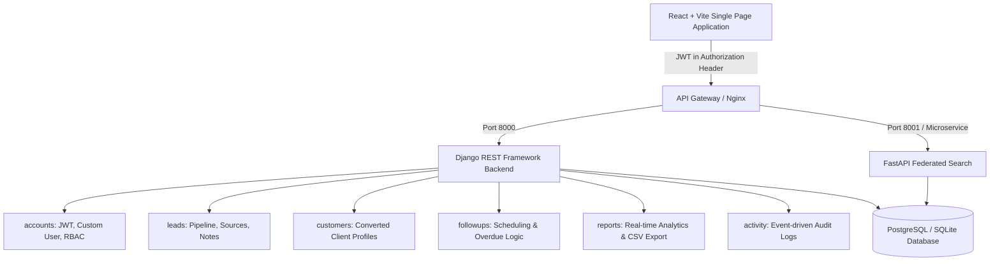

# CRM Lite — System Architecture

## 1. High-Level Architecture Overview

CRM Lite follows a modern, decoupled client-server architecture built for high performance, role-based security, and seamless developer onboarding.

## 2. Key Technology Components

### Backend
- **Framework**: Django 6.x + Django REST Framework 3.18
- **Authentication**: `rest_framework_simplejwt` (JWT access & refresh tokens)
- **Database Engine**: PostgreSQL for production / SQLite fallback for local zero-config testing
- **API Documentation**: OpenAPI 3.0 via `drf-spectacular` (Swagger UI at `/api/docs/`)
- **Query Optimizations**: `select_related`, `prefetch_related`, and targeted database indexes on `phone`, `email`, `status`, and `assigned_to` to prevent N+1 query overhead.

### Frontend
- **Framework**: React 19 + Vite
- **Routing**: React Router v7
- **HTTP Client**: Axios with automated token refresh interceptor
- **Styling**: Vanilla/Plain CSS with custom design tokens, dark mode glassmorphism, responsive breakpoints, and custom typography (`Plus Jakarta Sans` & `Outfit`).
- **Icons**: `lucide-react`

### Microservice (Optional Search Engine)
- **Framework**: FastAPI + Uvicorn
- **Purpose**: Sub-10ms global federated search across Leads and Customers.

---

## 3. Workflow Progression

1. **Lead Creation**: Rep creates a prospect (with name, company, phone, email, source, initial priority, and expected value).
2. **Assignment**: Sales Manager or Admin assigns or reassigns the lead to a Sales Executive.
3. **Engagement**: The executive schedules phone calls, demos, or meetings and records detailed communication notes.
4. **Pipeline Traversal**: Leads advance through stages (`NEW` → `CONTACTED` → `DEMO_SCHEDULED` → `NEGOTIATION` → `QUALIFIED`).
5. **Atomic Conversion**: Once marked `QUALIFIED`, a Sales Manager converts the lead to a permanent `Customer` record inside an atomic database transaction (`transaction.atomic()`). The lead status updates to `WON` and the complete conversation and activity history is retained.
6. **Lost Deals**: If a deal does not close, it transitions to `LOST` with a mandatory reason for retrospective reporting.
